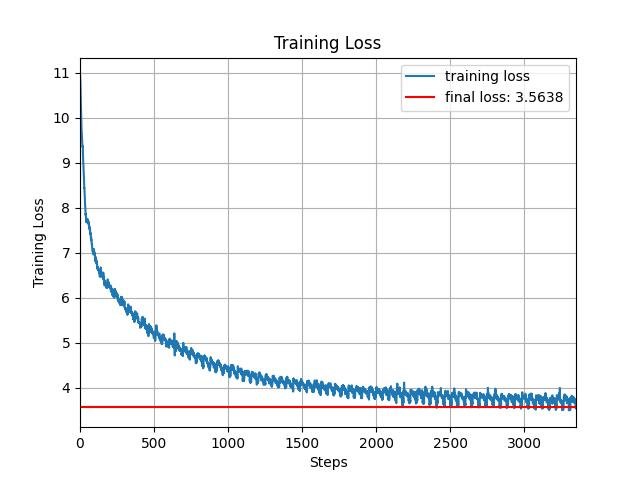
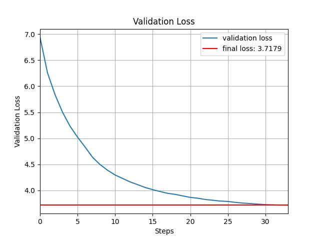

# SPQR - Structured Pretraining for Querying Robotics Implementation

[](https://pytorch.org/)
[](LICENSE)

A PyTorch implementation of GPT-2, inspired by Andrej Karpathy's [Neural Networks: Zero to Hero](https://karpathy.ai/zero-to-hero.html) series. This project includes support for multi-GPU training, flash attention, and a focus on scalability.

---

## Features
- **GPT-2 Architecture**: Based on the "Attention Is All You Need" paper.
- **Flash Attention**: Optimized attention mechanism for faster training.
- **Multi-GPU Support**: Distributed training using PyTorch's `DistributedDataParallel`.
- **Scalable**: Works on single GPU, multi-GPU, and CPU (not recommended for training).

---

## Hyperparameters (GPT-2 from OpenAI)
- `block_size`: 1024 (context length)
- `vocab_size`: 50304
- `n_layer`: 12 (number of transformer layers)
- `n_head`: 12 (number of attention heads)
- `n_embd`: 768 (embedding dimension)
- `total_batch_size`: 524288
- `B`: 64 (batch size)
- `T`: 1024 (sequence length)

---

## Architecture
```python
self.transformer = nn.ModuleDict(dict(
    wte = nn.Embedding(config.vocab_size, config.n_embd),  # token embeddings
    wpe = nn.Embedding(config.block_size, config.n_embd),  # position embeddings
    h = nn.ModuleList([Block(config) for _ in range(config.n_layer)]),  # transformer blocks
    ln_f = nn.LayerNorm(config.n_embd)  # final layer norm
))
self.lm_head = nn.Linear(config.n_embd, config.vocab_size, bias=False)  # language model head
```

---

## Installation

### Prerequisites
- Python 3.8+
- PyTorch 2.0+
- CUDA 11.7+ (for GPU acceleration)

```bash
pip install torch numpy tiktoken
```

---

## Usage

### Training
```bash
# Single GPU
python train.py --batch_size 64 --context_length 1024

# Multi-GPU (4 GPUs)
torchrun --nproc_per_node=4 train_gpt-2.py --batch_size 64 --context_length 1024 --ddp
```

---

## Results

### Initial Training Run
- **Iterations**: 3400
- **Batch Size**: 32
- **Sequence Length**: 512
- **Training Loss**: 3.56
- **Validation Loss**: 3.72
- **HellaSwag Evaluation**: 26%

#### Comparison with GPT-2
- OpenAI's GPT-2 achieved **28.92%** on the same HellaSwag evaluation with:
  - **Iterations**: 19073
  - **Batch Size**: 128
  - **Sequence Length**: 1024

The results indicate that the model performs competitively, with room for improvement by tuning hyperparameters and scaling up training.

### Training Curves
Below are the training and validation loss curves:




### Future Improvements
- **Hyperparameters**: Increase the hyperparameters to be the same as the ones proposed in the OpenAI model
- **Shards**: there seems to be some periodicity in the training loss and it might be solved by shuffling the shards before feeding them to the neural network
- **Bias**: uncomment the bias variable in GPTConfig and add an option to the linear layers. Results might improve by removing some of the biases
- **GeLU**: The GeLU function is passed with 'tanh' argument in the MLP class to make the model as close as possible to GPT-2. Results might improve without passing any argument in the function.
---

## Acknowledgments
- Inspired by Andrej Karpathy's [Neural Networks: Zero to Hero](https://karpathy.ai/zero-to-hero.html) series.
- Uses flash attention for optimized performance.
- Based on the architecture from [Attention Is All You Need](https://arxiv.org/abs/1706.03762).

---

## License
This project is licensed under the MIT License.
